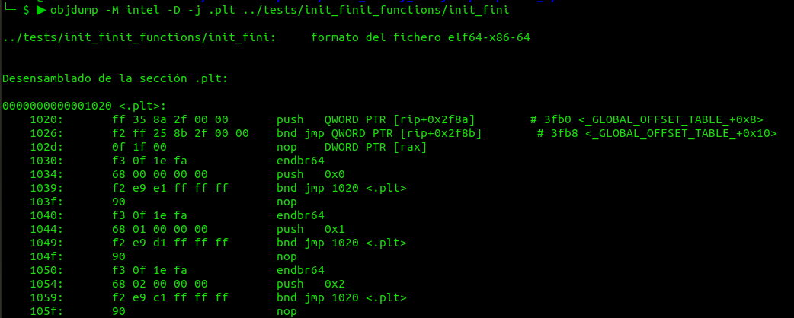
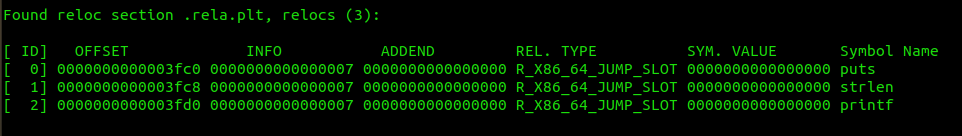
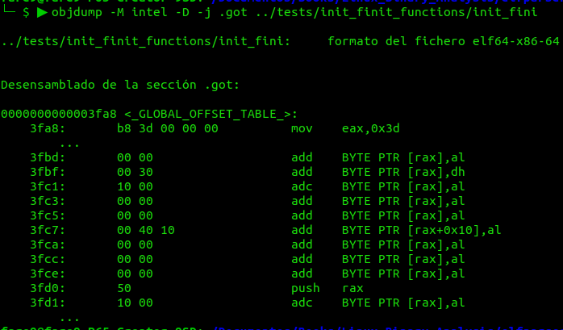

# ELF File

Three main types of ELF files:

* *relocatable file* holds code and data suitable for linking with other object files, to create an executable or shared object.
* *executable file* program suitable for execution.
* *Shared object file* code and data suitable for linking in two contexts. Link editor may process it with other relocatable and shared object files to create another object file. Second, dynamic linker combines it with executable file and other shared objects to create process image.

## File Format

For convenience and efficiency, object file format provides different views depending on environment:

```
    Linking View                 Execution View

+------------------+          +------------------+
|                  |          |                  |
|     ELF Header   |          |     ELF Header   |
|                  |          |                  |
+------------------+          +------------------+
|  Program Header  |          |  Program Header  |
|  Table (optional)|          |  Table           |
|                  |          |                  |
+------------------+          +------------------+
|                  |          |                  |
|     Section 1    |          |                  |
|                  |          |    Segment 1     |
+------------------+          |                  |
|       ...        |          |                  |
+------------------+          +------------------+
|                  |          |                  |
|     Section n    |          |                  |
|                  |          |    Segment 2     |
+------------------+          |                  |
|       ...        |          |                  |
+------------------+          +------------------+
|       ...        |          |      ...         |
+------------------+          +------------------+
|  Section Header  |          |  Section Header  |
|  Table           |          |  Table (optional)|
|                  |          |                  |
+------------------+          +------------------+
```

*Elf header* is at the beginning used as a "road map" describing file's organization. *Sections* are the bulk of object file information for linking view: instructions, data, symbol table, relocation information, and so on.

A *program header table* tells system how to create a process image. So files that will be executed needs from a program header table; relocatable files do not need one (not intended to be executed). A *section header table* contains information describing file's sections. Every section has an entry; each entry gives information (section name, size, etc). Files used during linking must have a section header table.

**Important** the order of the tables in the figure may differ. Sections and segments have no specified order. Only ELF header has a fixed position, and this gives the offsets to the other headers.

## Data Representation

Object file format supports various processors (8, 32 or 64 bits) but it's intended to be extensible to larger or smaller architectures. Object files therefore represent some control data with machine-independent format, making possible identify object files and interpret contents in a common way. So data used will be always the same regardless of machine on which the file was created:

| Name | Size | Alignment | Purpose |
|:-----|:----:|:---------:|:-------:|
| *Elf32_Addr* | 4 | 4 | Unsigned program address |
| *Elf32_Half* | 2 | 2 | Unsigned medium integer |
| *Elf32_Off* | 4 | 4 | Unsigned file offset |
| *Elf32_Sword* | 4 | 4 | Signed large integer |
| *Elf32_Word* | 4 | 4 | Unsigned large integer
| *unsigned char* | 1 | 1 | Unsigned small integer |

Data structures that object file format defines follow "natural" size and alignment. If necessary, explicit padding is used to ensure 4-byte alignment for 4-byte objects. Data also have alignment from the beginning of the file. An structure containing an *Elf32_Addr* will be aligned on a 4-byte boundary within the file.

**ELF uses no bit fields**

## Character Representations

When in ELF structure some part mention character constant, the numerical value should follow the 7-bit ASCII guidelines. Character values outside range of 0 to 127 may occupy one or more bytes. Applications can control their own character sets, using different character set extensions for different languages as appropiate. Guidelines:

* Character between 0 and 127 correspond to 7-bit ASCII code.
* Multibyte character encodings with values above 127 should contain only bytes with values outside range of 0 to 127.
* Multibyte characters should be self-identifying. That allows, any multibyte character to be inserted between any pair of multibyte characters, without changing characters' interpretations.

## Elf Header

Some object file control structures can grow, because ELF header contains their sizes. If object file format changes, a program may encounter control structures that are larger or smaller than expected. Programs might ignore "extra" information.

The structure for this header, can be found in *elf_generic_types.h* structure *Elf_Ehdr*:

* *e_ident*: mark file as object file, provide machine-independent data to decode and interpret file's content.
* *e_type*: identifies object file type as relocatable, executable, shared object or core (also a no file type).
* *e_machine*: specifies required architecture for individual file, examples are AT&T WE 32100, SPARC, Intel, MIPS, etc.
* *e_version*: identifies object file version, for the moment *EV_NONE* and *EV_CURRENT* are used only.
* *e_entry*: virtual address of the entry point, if no entry point, zero is written here.
* *e_phoff*: program header table's file offset in bytes.
* *e_shoff*: section header table's file offset in bytes.
* *e_flags*: processor-specific flags associated with file. Flag names take form *EF_machine_flag*
* *e_ehsize*: ELF header's size in bytes.
* *e_phentsize*: size in bytes of one entry in file's program header table, all entries have same size.
* *e_phnum*: number of entries in program header table. So *e_phentsize* x *e_phnum* gives table's size in bytes.
* *e_shentsize*: section header's size in bytes. All entries are same size.
* *e_shnum*: number of entries in section header table. So *e_shentsize* x *e_shnum* gives table's size in bytes.
* *e_shstrndx*: holds section header table index of entry associated with section name string table. 

## Elf Identification

Initial bytes of file specify how to interpret the file, independent of the processor on which the inquiry is made and independent of file's remaining contents. Initial bytes of ELF header (and object file) correspond to *e_ident* member:

| Name | Value | Purpose |
|:-----|:-----:|:--------|
| *EI_MAG0* | 0 | File identification |
| *EI_MAG1* | 1 | File identification |
| *EI_MAG2* | 2 | File identification |
| *EI_MAG3* | 3 | File identification |
| *EI_CLASS* | 4 | File class |
| *EI_DATA* | 5 | Data encoding |
| *EI_VERSION* | 6 | File version |
| *EI_PAD* | 7 | Start of padding bytes |
| *EI_NIDENT* | 16 | size of *e_ident[]* |

From *EI_MAG0* to *EI_MAG3* we have the "magic number", which idenity ELF object, contain next values:

| Name | Value | Meaning |
|:-----|:-----:|:--------|
| *ELFMAG0* | *0x7f* | e_ident\[EI_MAG0\] |
| *ELFMAG1* | *'E'* | e_ident\[EI_MAG1\] |
| *ELFMAG2* | *'L'* | e_ident\[EI_MAG2\] |
| *ELFMAG3* | *'F'* | e_ident\[EI_MAG3\] |

*EI_CLASS* identifies file's class or capacity. The class *ELFCLASS32* supports machines with files and virtual address spaces up to 4 gigabytes; it uses basic types defined above. *ELFCLASS64* is incomplete and refers to 64-bit architectures. Other classes will be necessary, with different basic types and sizes for object file data.

| Name | Value | Meaning |
|:-----|:-----:|:--------|
| *ELFCLASSNONE* | 0 | Invalid class |
| *ELFCLASS32* | 1 | 32-bit objects |
| *ELFCLASS64* | 2 | 64-bit objects |

The value *EI_DATA* specifies encoding of processor-specific data (little endian or big endian)

| Name | Value | Meaning |
|:-----|:-----:|:--------|
| *ELFDATANONE* | 0 | Invalid data encoding |
| *ELFDATA2LSB* | 1 | Little endian |
| *ELFDATA2MSB* | 2 | Big endian |

*EI_VERSION* os ELF header version number. As said previously it must be *EV_CURRENT*.

*EI_PAD* beginning of unused bytes. Bytes reserved and set to zero; programs that read object files should ignore them.

## Sections

Object file's section header table lets one locate all file's sections. Section header is an array of *Elf32_Shdr* structures. Section header table index is a subscript into this array. ELF header's *e_shoff* gives offset from beginning of file to section header table; *e_shnum* gives number of entries section header table contains; *e_shentsize* gives size in bytes of each entry.

There are some special section table header indexes reserved, and no sections exist for them:

| Name | Value |
|:-----|:-----:|
| *SHN_UNDEF* | 0 |
| *SHN_LORESERVE* | 0xff00 |
| *SHN_LOPROC* | 0xff00 |
| *SHN_HIPROC* | 0xff1f |
| *SHN_ABS* | 0xfff1 |
| *SHN_COMMON* | 0xfff2 |
| *SHN_HIRESERVE* | 0xffff |

* *SHN_UNDEF*: undefined, missing, irrelevant or meaningless. Exist an index 0 as it starts the section indexes by 0.
* *SHN_LORESERVE*: lower bound of range of reserved indexes.
* *SHN_LOPROC*-*SHN_HIPROC*: values in inclusive range, reserved for processor-specific semantics.
* *SHN_ABS*: absolute values for corresponding reference. Symbols defined relative to section number *SHN_ABS* have absolute values, not affected by relocation.
* *SHN_COMMON*: Symbols defined relative to this section are common symbols (e.g. unallocated C external variables).
* *SHN_HIRESERVE*: upper bound of range of reserved indexes. Values do not reference section header table. Section header table does not contain entries for reserved indexes.

Section contains all information in object file (except ELF header, program header table and section header table). Object files' sections satisfy conditions:

* Every section has exactly one section header describing it. Can exist section header without section.
* Each section occupies one contiguous sequence of bytes within a file.
* Sections in a file may not overlap. No byte in file resides in more than one section.
* Object file may have inactive space. Various headers and sections might not "cover" every byte in object file.

Structure of section header can be found in *elf_generic_types.h* in structure *Elf_Shdr*:

* *sh_name*: name of section; index into section header string table section, location of null-terminated string. 
* *sh_type*: categorizes section's contents and semantics. Different values can be used for sh_type:
    * *SHT_NULL* (0): value marks section header as inactive; no associated section. Other members may have undefined values.
    * *SHT_PROGBITS* (1): Section holds information defined by program, format and meaning determined by program. This section exist on disk.
    * *SHT_SYMTAB* (2) and *SHT_DYNSYM* (11):  symbol tables (useful for parsing symbols).
    * *SHT_STRTAB*: string table. Three different can be found by name: .dynstr (Dynamic Symbols names), .strtab (Symbols names), .shstrtab (section header names).
    * *SHT_RELA*: Relocation entries with explicit addends (type *Elf32_Rela*). Object file may have multiple relocation sections.
    * *SHT_HASH*: symbol hash table.
    * *SHT_DYNAMIC*: Information for dynamic linking.
    * *SHT_NOTE*: information that marks file in some way.
    * *SHT_NOBITS*: type that occupies no space in the file, only in memory (example .bss), *sh_offset* contains conceptual file offset.
    * *SHT_REL*: relocation entries without explicit addends (type *Elf32_Rel*).
    * *SHT_SHLIB*: reserved without unspecified semantics.
    * *SHT_LOPROC* to *SHT_HIPROC*: values in this range, reserved for processor-specific semantics.
    * *SHT_LOUSER*: lower bound of range of indexes reserved for application programs.
    * *SHT_HIUSER*: upper bound of range of indexes reserved for application programs. Section types between previous and this one, can be used without conflicting with current or future system-defined section names.

As we said there was an index 0, but all its values are 0, *sh_type* equals to *SHT_NULL* and *sh_link* equals to *SHN_UNDEF*.

* *sh_flags*: miscellaneous attributes. This are 1 bit flag, values can be:
    * *SHF_WRITE* (0x1): data should be writable during process execution.
    * *SHF_ALLOC* (0x2): section occupies memory during process execution.
    * *SHF_EXECINSTR* (0x4): section contains executable machine instructions.
    * *SHF_MASKPROC* (0xf0000000): All bits in this mask are reserved for processor-specific semantics.

* *sh_addr*: if section **appear in memory image** of process, member gives address which section's first byte should reside. Otherwise, 0.

* *sh_offset*: byte offset from beginning of file to first byte in section. A section type *SHT_NOBITS* **occupies no space in file**, its *sh_offset* locates conceptual placement in file.

* *sh_size*: section size in bytes.
* *sh_link*: section header table index link (points to another section), interpretation depends on section type.

Different interpetation exist from these two section types, next table summarize the type, the value for link, and the value for info:

| *sh_type* | *sh_link* | *sh_info* |
|:----------|:----------|:----------|
| SHT_DYNAMIC | The section header index of the string table used by entries in the section | 0 |
| SHT_HASH | The section header index of symbol table to which the hash table applies | 0 |
| SHT_REL   SHT_RELA | Section header index of associated symbol table | The section header index of section to which relocation applies |
| SHT_SYMTAB   SHT_DYNSYM | Information is operating system specific | Information is operating system specific |
| other | *SHN_UNDEF* | 0 |

* *sh_info*: extra information, interpretation depends on section type.
* *sh_addralign*: address alignment constraints. *sh_addr* must be congruent to 0, modulo the value of *sh_addralign*. Only 0 and positive integral powers of two are allowed.
* *sh_entsize*: Some sections hold table of fixed-size entries, such as symbol table. For such a section, member gives size in bytes of each entry, member contains 0 if section does not hold a table of fixed-size entries.

## Special Sections

Sections pre-defined hold program and control information. Sections used by operating system, different types and attributes for different operating systems.

Executable files = object files + libraries (through linking process). Linker resolves references (subroutines and data references) among different object files, adjusts absolute references in object files, and relocates instructions. Linking and Loading, require information defined in object files, information is stored in specific sections such as *.dynamic*.

Different set of linking models from operating systems:

* *Static*: set of object files, system libraries and library archives statically bound, references are resolved, and executable file is created completely self contained.
* *Dynamic*: set of object files, libraries, system shared resources and shared libraries linked together to create executable. When executable is loaded, other shared resources and dynamic libraries must be available in system for program to run successfully. Method to resolve references at execution time will be explained later.

Section exists that support debugging (*.debug* and *.line*), and program control (*.bss*, *.data*, *.rodata*).

* *.bss*: uninitialized data, contribute to program's memory image. Data is initialized with zeros. Section occupies no file space, section type *SHT_NOBITS*.
* *comment*: version control information.
* *.data*: data that contribute to program's memory image.
* *.debug*: information for symbolic debugging. Reserved for future use.
* *.dynamic*: dynamic linking information, it has attributes such as *SHF_ALLOC* and *SHF_WRITE*.
* *.hash*: symbol hash table.
* *.line*: line number information for symbolic debugging, correspondence between source program and machine code.
* *.note*: information in a format later explained.
* *.rodata*: read-only data, commonly contribute to a non-writable segment in process image.
* *.shstrtab*: section names table.
* *.strtab*: strings that represent names associated with symbol table entries.
* *.symtab*: symbol table.
* *.text*: executable instructions of a program.

Section names that start with a dot prefix are reserved for system. Applications may use names without prefix to avoid conflicts with system sections. Object file format lets one define sections not in the list above, object file may have more than one section with the same name.

## String table

default string table, it holds null-terminated character sequences (strings). Object file uses strings to represent symbol and section names, they reference a string as an index to their first byte. First byte of string table is a null byte. Last byte of string table is also a null byte, ensuring null termination for all strings. String whose index is zero specifies either no name or null name, depending on context.

Section header's *sh_name* holds index into section header string table section, designed by *e_shstrndx* member of ELF header.

## Symbol Table

Information needed to locate and relocate program's symbolic definitions and references. Symbol table index is subscript into this array. Index 0 is first entry in table and serves as undefined symbol index. Structure of symbol is in the file *elf_generic_types.h* in the struct *Elf_Sym*:

* *st_name*: index into object file's symbol string table, character representations of symbol names.
* *st_value*: value of associated symbol. Depending on context, it maybe absolute value, address, and so on.
* *st_size*: many symbols have associated sizes. A data object's size is number of bytes contained in object. Member is 0 if symbol has no size or an unknown size.
* *st_info*: symbol's type and binding attributes.

Next code can be used to get the values from *st_info*:

```C
uint64_t type, bind;

if (is_32_bit_binary())
{
    type = ELF32_ST_TYPE(st_info);
    bind = ELF32_ST_BIND(st_info);
}
else if (is_64_bit_binary())
{
    type = ELF64_ST_TYPE(st_info);
    bind = ELF64_ST_BIND(st_info);
}

switch (type)
{
case STT_NOTYPE:
    printf("NOTYPE ");
    break;
case STT_OBJECT:
    printf("OBJECT ");
    break;
case STT_FUNC:
    printf("FUNC   ");
    break;
case STT_SECTION:
    printf("SECTION");
    break;
case STT_FILE:
    printf("FILE   ");
    break;
case STT_LOPROC:
    printf("LOPROC ");
    break;
case STT_HIPROC:
    printf("HIPROC ");
    break;
}

switch (bind)
{
case STB_LOCAL:
    printf("LOCAL  ");
    break;
case STB_GLOBAL:
    printf("GLOBAL ");
    break;
case STB_WEAK:
    printf("WEAK   ");
    break;
}
```

So the info contains a bind, where all symbols with *STB_LOCAL* precede weak and global symbols. And the type is a general classification for the associated entity.

* *st_other*: no defined meaning.
* *st_shndx*: every symbol table entry "defined" in relation to some section; member holds relevant section header table index.

**Symbol Values**

Different interpretations for *st_value*:

* In relocatable files, *st_value* holds alignment constraints for symbols whose section index is *SHN_COMMON*.
* In relocatable files, *st_value* holds a section offset for defined symbol. *st_value* is an offset from the beginning of the section that *st_shndx* identifies.
* In executable and shared object files, *st_value* holds virtual address. To make files' symbols more useful for dynamic linker, section offset gives way to a virtual address, so it's easier to work on memory and section number is irrelevant.

## Relocation

Process of connecting symbolic references with symbolic definitions. When a program calls a function, associated call instruction must transfer control to proper destination address at execution. Relocatable files must have information that describes how to modify section contents, allowing executable and shared object files to hold right information for process's program image. Two types of relocations structures are in *elf_generic_types.h* in *Elf_Rel* and *Elf_Rela*.

* *r_offset*: location at which to apply relocation action. For relocatable file, value is byte offset from beginning of the section to storage unit affected by relocation. For executable file or shared object, value is virtual address of storage unit affected by relocation (check **Quenya relocation mechanism**).

* *r_info*: member gives both symbol table index with respect to which relocation must be made, and type of relocation to apply. Example, a call instruction's relocation entry would hold symbol table index of function being called. If index is *STN_UNDEF*, undefined symbol index, relocation uses 0 as "symbol value". Relocation types are processor-specific; description of their behaviour appear in processor supplement.

* *r_addend*: constant addend used to compute value to be stored into relocatable field.

**Important**

Only *Elf_Rela* entries contain explicit addend. Entries of type *Elf_Rel* store implicit addend in location to be modified. Depending on processor architecture, one form or other might be necessary or more convenient. Implementation for particular machine may use one form exclusively or either form depending on context.

A relocation section references two other sections: a symbol table and a section to modify. Section header's values *sh_info* and *sh_link* members, specify these relationships. Relocation entries for different object files have slightly different interpretations for *r_offset* member.

* In relocatable files, *r_offset* holds section offset. Relocation section itself describes how to modify another section in file.
* In executable and shared object files, *r_offset* holds virtual address. So make relocation entries more useful for dynamic linker.

# Quenya relocation mechanism

From the Learning Linux Binary Analysis we extract the next relocation mechanism from author's program *Quenya*:

```C
switch(obj.shdr[i].sh_type) /* first going through all the sections checking its type */
{
case SHT_REL: /* Section contains ElfN_Rel records */

    /* Point to the array of relocs */
    rel = (Elf32_Rel *)(obj.mem + obj.shdr[i].sh_offset);

    /* Now go through all of those relocs */
    for (j = 0; j < obj.shdr[i].sh_size / sizeof(Elf32_Rel); j++, rel++)
    {
        /* 
        *   The sh_link from the section of the reloc
        *   points to a symbol section, so we can use
        *   this to point to the symbols
        */
        /* symbol table */
        symtab = (Elf32_Sym *)obj.section[obj.shdr[i].sh_link];

        /* symbol we are applying relocation to */
        symbol = &symtab[ELF32_R_SYM(rel->r_info)];

        /*
        *   TargetSection = section to apply the reloc
        *   TargetIndex = index of the previous section
        * 
        *   All of them pointed by sh_info of reloc section.
        */
        /* section to modify */
        TargetSection = &obj.shdr[obj.shdr[i].sh_info];
        TargetIndex = obj.shdr[i].sh_info;

        /*
        *   Address or offset where to apply
        *   the relocation, using the base address
        *   of target section, and the offset
        */
        /* target location */
        TargetAddr = TargetSection->sh_addr + rel->r_offset;

        /*
        *   Pointer to where to apply the reloc
        */
        /* pointer to relocation target */
        RelocPtr = (Elf32_Addr *)(obj.section[TargetIndex] + rel->r_offset);

        /*
        *   Get the value we need to modify
        */
        /* relocation value */
        RelVal = symbol->st_value;
        RelVal += obj.shdr[symbol->st_shndx].sh_addr;

        printf("0x%08x %s addr: 0x%x\n",RelVal, 
        &SymStringTable[symbol->st_name], TargetAddr);

        /* 
        *   As the info type depends on the
        *   processor, a macro is needed to
        *   get the type. Then different values
        *   are checked.
        switch (ELF32_R_TYPE(rel->r_info))
        {
        /* R_386_PC32   2   word32  S + A - P */
        case R_386_PC32:
            *RelocPtr += RelVal;
            *RelocPtr -= TargetAddr;
            break;
        
        /* R_386_32     1   word32  S + A */
        case R_386_32:
            *RelocPtr += RelVal;
            break;
        }
    }
}
```


# Program Loading and Dynamic Linking

To execute program, system uses files to create dynamic program representations, or process images. Process image has segments that hold text, data, stack and so on. This section describes object file structures that relate directly to program execution. Primary data structure, program header table, locates segment images within file and contains other information necessary to create memory image for program.
Given object file, system must load it into memory for program to run. After system loads program, it must complete process image resolving symbolic references among object files that compose the process.

## Program Header

Array of structures, each describing a segment or other information system needs to prepare program for execution. An object file *segment* contains one or more *sections*. Program header are meaningful only for executable and shared object files. The offset to the program header table is specified by *e_phoff*, and the number of structures can be obtained using *e_phentsize* and *e_phnum*.

* *p_type*: What kind of segment this array element describes, or how to interpret array element's information.
    * *PT_NULL* (0): array element unused, other values are undefined, program loader can ignore these segments.
    * *PT_LOAD* (1): loadable segment, described by *p_filesz* and *p_memsz*. Bytes from file, mapped to beginning of memory segment. If *p_memsz* > *p_filesz* padding is done with value 0. File size may not be larger than memory size. Loadable segment entries in program header table appear in ascending order, sorted on *p_vaddr* member.
    * *PT_DYNAMIC* (2): array element specifies dynamic linking information.
    * *PT_INTERP* location and size of a null-terminated path name to invoke as an interpreter.
    * *PT_NOTE*: location and size of auxiliary information.
    * *PT_PHDR*: location and size of program header table itself, both in file and in memory image. Segment type may not occur more than once in a file, and only if program header table is part of memory image. If present, it must precede any loadable segment entry.
    * *PT_LOPROC* to *PT_HIPROC*: values in this range, reserved for processor-specific semantics.
* *p_offset*: offset from beginning of file at which first byte of segment resides.
* *p_vaddr*: Virtual address at which first byte of segment resides in memory.
* *p_paddr*: for system which physical addressing is relevant, member is reserved for segment's physical address. This member requires operating system specific information.
* *p_filesz*: number of bytes in file image of segment; it may be zero.
* *p_memsz*: number of bytes in memory image of segment.
* *p_flags*: flags relevant to the segment.
* *p_align*: loadable process segments must have congruent values for *p_vaddr* and *p_offset*, module page size. Member gives the value to which the segments are aligned in memory and in the file. Value 0 and 1, no alignment required. 

## Note Section

Sometimes necessary mark object file with special information that other programs will check for conformance, compatibility, etc. Sections *SHT_NOTE* and program header of type *PT_NOTE* can be used for this. Note information in both, holds any number of entries, each is an array of 4-byte words in format of target processor.

```
    +-----------------------+
    |         namesz        |
    +-----------------------+
    |         descsz        |
    +-----------------------+
    |         type          |
    +-----------------------+
    |         name          |
    |         ...           |
    +-----------------------+
    |         desc          |
    |         ...           |
    +-----------------------+
```

*namesz* and *name* first namesz bytes in name is a null-terminated character representation of entry's owner. No formal mechanism for avoiding name conflicts. Convention, vendors use their own name (e.g. XYZ Computer Company). If no name is present, namesz contains 0. Padding is present, if necessary, to ensure 4-byte alignment for descriptor. Padding is not included in namesz.

*descsz* and *desc* first descsz bytes in desc hold note descriptor. ELF places no constraints on descriptor's contents. No descriptor present, descsz contains 0, padding is present in case to ensure 4-byte alignment. Padding is not included in descsz.

*type* interpretation of descriptor. Each originator controls its own types. A program must recognize both name and type to "understand" a descriptor. Types must be non-negative. ELF does not define what descriptors mean.

## Program Loading

Process by which operating system creates or augments a process image. The manner in which process is accomplished and how page management functions for process are handled are dictated by operating system and processor. (End of notes)

## Dynamic Linking

resolves references either at process initialization time and/or at execution time. Some basic mechanisms need to be set up for a particular linkage model to work, there are ELF sections and header elements reserved for this purpose. (End of notes)

## Special Section Names

### Special Sections

* *.bss*
* *.comment*
* *.data*
* *.data1*
* *.debug*
* *.dynamic*
* *.dynstr*
* *.dynsym*
* *.fini*
* *.got*
* *.hash*
* *.init*
* *.interp*
* *.line*
* *.note*
* *.plt*
* *.relname*
* *.relaname*
* *.rodata*
* *.rodata1*
* *.shstrtab*
* *.strtab*
* *.symtab*
* *.text*

## Dynamic Section Names

*_DYNAMIC*

### Dynamic Array Tags

* *DT_NULL*
* *DT_NEEDED*
* *DT_PLTRELSZ*
* *DT_PLTGOT*
* *DT_HASH*
* *DT_STRTAB*
* *DT_SYMTAB*
* *DT_RELA*
* *DT_RELASZ*
* *DT_RELAENT*
* *DT_STRSZ*
* *DT_SYMENT*
* *DT_INIT*
* *DT_FINI*
* *DT_SONAME*
* *DT_RPATH*
* *DT_SYMBOLIC*
* *DT_REL*
* *DT_RELSZ*
* *DT_RELENT*
* *DT_PLTREL*
* *DT_DEBUG*
* *DT_TEXTREL*
* *DT_JMPREL*
* *DT_BIND_NOW*
* *DT_LOPROC*
* *DT_HIPROC*

## Pre-existing Extensions

Naming conventions for ELF constants that have processor ranges specified. Names such as *DT_*, *PT_* for processor specific extensions incorporate name of the processor, example, *DT_M32_SPECIAL*. Pre-existing processor extensions not using convention will be suported, example, *DT_JMP_REL*.

Section names reserved for processor architecture are formed placing an abbreviation of architecture name ahead of section name. Name should be taken from architecture names used for *e_machine*. Example *.FOO.psect* is *psect* section defined by FOO architecture. Extensions are called by historical names. Pre-existing extensions: *.sdata*, *.tdesc*, *.sbss*, *.lit4*, *.lit8*, *.reginfo*, *.gptab*, *.liblist*, *.conflict*.

## ELF Header

### Machine Identification

For file identification, *e_ident* in intel requires next values:

| Position | Value |
|:---------|:------|
| *e_ident[EI_CLASS]* | *ELFCLASS32* |
| *e_ident[EI_DATA]* | *ELFDATA2LSB* |

Processor identification resides in ELF header's *e_machine*, must have value *EM_386*.
ELF header's *e_flags* member holds bit flags associated with file. For intel no flags are defined, so member contains zero.

## Relocation

### Relocation Types

Relocation entries describe how to alter instruction and data fields (bit numbers appear in lower box corners):

```
+-------------------------------------+
|                                     |
|               WORD32                |
|31                                  0|
+-------------------------------------+
```

*word32* specifies a 32-bit field occupying 4 bytes with arbitrary byte alignment. Values use same byte order as other word values in Intel.

Calculations assume actions are transforming a relocatable file into either an executable or a shared object file. Link editor merges one or more relocatable files to form the output. First devices how to combine and locate input files, then updates the symbol values, finally performs relocation. Relocations applies to executable or shared object files are similar and accomplish same result. Notation:

* *A*: addend used to compute the value of the relocatable field.
* *P*: place (section offset or address) of storage unit being relocated (computed using *r_offset*).
* *S*: means the value of the symbol whose index resides in the relocation entry.

A relocation entry's *r_offset* value designates offset or virtual address of first byte of the affected storage unit. Relocation type specifies which bits to change and how to calculate their values. Intel architecture uses only *Elf32_Rel* relocation entries, field to be relocated holds the addend. Addend and computed result use same byte order.

**Relocation Types**

| Name | Value | Field | Calculation |
|:-----|:-----:|:------|:------------|
| *R_386_NONE* | 0 | none | none |
| *R_386_32* | 1 | word32 | *S+A* |
| *R_386_PC32* | 2 | word32 | *S+A-P |

## Sections

The following sections are UNIX System V Release 4 specific:

*SHT_SYMTAB* and *SHT_DYNSYM*: symbol table. Object file may have only one section of each type, restriction may be relaxed in the future. *SHT_SYMTAB* provides symbols for link editing, although it may also be used for dynamic linking. It may contain many symbols unnecessary for dynamic linking. Object file may also contain a *SHT_DYNSYM*, which holds a minimal set of dynamic linking symbols, to have space.

*SHT_STRTAB*: object file may have multiple string table sections.

*SHT_HASH*: all objects participating in dynamic linking must contain a symbol hash table. Currently, an object file may have only one hash table, but restriction may be relaxed in the future.

*SHT_DYNAMIC*: Currently, object file may have only one dynamic section, restriction may be relaxed in the future.

Two members in section header, *sh_link* and *sh_info*, hold special information, depending on section type. Symbol table section's *sh_info* holds symbol table index for first non-local symbol.

**sh_link** and **sh_info** Interpretation.

| sh_type | sh_link | sh_info |
|:--------|:--------|:--------|
| *SHT_SYMTAB* *SHT_DYNSYM* | The section header index of the associated string table. | One greater than the symbol table index of the last local symbol. (binding *STB_LOCAL*) |

## Special Sections

hold program and control information used in UNIX System V. Sections in list below are used by system and have indicated types and attributes. Most of these sections are required for linking process. Information for dynamic linking provided in *.dynsym*, *.dynstr*, *.interp*, *.hash*, *.dynamic*, *.rel*, *.rela*, *.got* and *.plt*. Contents of some of these sections are processor specific, but all support same linkage model.

* *.dynstr* (type: *SHT_STRTAB*, Attributes: *SHF_ALLOC*): holds strings needed for dynamic linking, most commonly strings that represent names associated with symbol table entries.
* *.dynsym* (type: *SHT_DYNSYM*, Attributes: *SHF_ALLOC*): holds the dynamic linking symbol table.
* *.fini* (type: *SHT_PROGBITS*, Attributes: *SHF_ALLOC+SHF_EXECINSTR*): holds executable instructions that contribute to the process termination code. When program exits normally, system executes code in this section.
* *.init* (type: *SHT_PROGBITS*, Attributes: *SHF_ALLOC+SHF_EXECINSTR*): holds executable instructions that contribute to process initialization code. When program starts to run, system executes code in this section before calling main program entry point.
* *.interp* (type: *SHT_PROGBITS*): path name of a program interpreter. If file has a loadable segment that includes section, section's attributes will include *SHF_ALLOC* bit, otherwise will be off.
* *.relname* and *.relaname* (type: *SHT_REL* and *SHT_RELA*): hold relocation information. If file has a loadable segment that includes relocation, section's attributes will include the *SHF_ALLOC* bit, otherwise will be off. Conventionally, *name* is supplies by section to which relocations apply. A relocation section for *.text* normally would have name *.rel.text* or *.rela.text*

## Symbol Table

*st_name* if value is non-zero, represents a string table index that gives symbol name. Otherwise symbol table entry has no name.

```C
if (elf_dynsym[i].st_name != 0)
{
    if (&DynSymbolStringTable[elf_dynsym[i].st_name])
        printf("%s", &DynSymbolStringTable[elf_dynsym[i].st_name]);
}

if (elf_symtab[i].st_name != 0)
{
    if (&SymbolStringTable[elf_symtab[i].st_name])
        printf("%s", &SymbolStringTable[elf_symtab[i].st_name]);
}
```

**important to know**

Function symbols (those with type *STT_FUNC*) in shared object files have special significance. When object file references a function from shared object, link editor creates a procedure linkage table entry for referenced symbol. Shared object symbols with types other than *STT_FUNC* will not be referenced automatically through procedure linkage table.

Global and weak symbols differ in two major ways:

* When link editor combines relocatable object files, it does not allow multiple definitions of *STB_GLOBAL* symbol with same name. On other hand, if defined global symbol exists, appearance of weak symbol with same name will not cause error. Link editor honors global definition and ignores weak ones. Similarly, if common symbol exists (symbol whose *st_shndx* field holds *SHN_COMMON*), appearance of weak symbol with same name will not cause error. Link editor honors common definition and ignores weak ones.
* When link editor searches archive libraries, it extracts archive members that contain definitions of undefined global symbols. Member's definition may be either global or a weak symbol. Link editor does not extract archive members to resolve undefined weak symbols. Unresolved weak symbols have zero value.

## Program Header

Following program header information is specific to UNIX System V Release 4.

* *p_paddr*: on systems for which physical addressing is relevant, member is reserved for segment's physical address. It can contains unspecified contents for executable files and shared objects.
* *p_align*: loadable process segments must have congruent values for *p_vaddr* and *p_offset*, modulo the page size.

Some entries describe process segments; other give supplementary information and do not contribute to process image. Segment entries may appear in any order.

Some *p_type* values:

* *PT_LOAD* (1): array element specifies loadable segment, described by *p_filesz* and *p_memsz*.
* *PT_DYNAMIC* (2): array element specifies for dynamic linking information. (check "Dynamic Section").
* *PT_INTERP* (3): array element specifies location and size of a null-terminated path name to invoke as interpreter. Segment type meaningful for executable files, it may not occur more than once in a file. If it's present, it must precede any loadable segment entry. (check "Program Interpreter").
* *PT_SHLIB* (5): reserved but has unspecified semantics.
* *PT_PHDR* (6): array element if present, specifies location and size of program header table itself.

### Base Address

Virtual address in program headers might not represent actual virtual address of program's memory image. Executable files typically contain absolute code. To let process execute correctly, segments must reside at virtual address used to build executable file. On other hand, shared object segments contain *position-independent* code. This lets a segment's virtual address change from one process to another. Though system chooses virtual address for individual processes, it maintains segments' relative positions. Because *position-independent* code uses relative addressing between segments, difference between virtual address in memory must match difference between virtual address in file, thus a single constant value for any one executable or shared object in a given process. Difference is the *base address*. One use of base address is to relocate memory image of program during dynamic linking.
Executable or shared object file's base address is calculated during execution from three values: virtual memory load address, maximum page size, and lowest virtual address of program's loadable segment. To compute base address, one determines memory address associated with the lowest *p_vaddr* value for a *PT_LOAD* segment. Address is truncated to nearest multiple of maximum page size. Corresponding *p_vaddr* value is also truncated to nearest multiple of maximum page size. Base address is difference between truncated memory address and truncated *p_vaadr* value.

### Segment Permissions

A program to be loaded by system must have at least one loadable segment (not required by file format). When system creates loadable segments' memory images, it gives access permissions as specified in *p_flags*:

| Name | Value | Meaning |
|:-----|------:|:--------|
| *PF_X* | *0x1* | Execute |
| *PF_W* | *0x2* | Write |
| *PF_R* | *0x4* | Read |
| *PF_MASKPROC* | *0xf0000000* | Unspecified |

All bits in *PF_MASKPROC* are reserved for processor-specific semantics. If meanings are specified, processor supplement explains them.
If a permission bit is 0, type of access is denied. Actual memory permission depend on memory management unit, which may vary from one system to another. Although all flag combinations are valid, system may grant more access than requested. In no case, a segment will have write permission unless it is specified explicitly. Following table shows exact flag interpretation and allowable flag interpretation.

| Flag | Value | Exact | Allowable |
|:-----|:-----:|:------|:----------|
| none | *0* | All access denied | All access denied |
| *PF_X* | *1* | Execute only | Read, execute |
| *PF_W* | *2* | Write only | Read, write, execute |
| *PF_W + PF_X* | *3* | Write, execute | Read, write, execute |
| *PF_R* | *4* | Read only | Read, execute |
| *PF_R + PF_X* | *5* | Read, execute | Read, execute |
| *PF_R + PF_W* | *6* | Read, write | Read, write, execute |
| *PF_R + PF_W + PF_X* | *7* | Read, write, execute | Read write, execute |

Text segments have read and execute (but not write). Data normally have read, write and execute permissions.

### Segment Contents

An object file segment comprises one or more sections, fact is transparent to program header, also it is immaterial to program loading. Nonetheless, various data must be present for program execution, dynamic linking, and so on. Diagrams below illustrate segment contents in general terms. Order and membership of sections within a segment may vary, processor-specific constraints may alter examples below.

**Text Segment**

Text segments contain read-only instructions and data, includding following sections. Other sections may also reside in loadable segments.

```
+-----------------+
|      .text      |
+-----------------+
|      .rodata    |
+-----------------+
|      .hash      |
+-----------------+
|      .dynsym    |
+-----------------+
|      .dynstr    |
+-----------------+
|      .plt       |
+-----------------+
|      .rel.got   |
+-----------------+
```

**Data Segment**

Data segments contain writable data and instructions, includding the following sections:

```
+-----------------+
|      .data      |
+-----------------+
|      .dynamic   |
+-----------------+
|      .got       |
+-----------------+
|      .bss       |
+-----------------+
```

A *PT_DYNAMIC* program header element points at *.dynamic* section (explained later). *.got* and *.plt* sections also hold information related to position-independent code and dynamic linking. Although *.plt* appeas in text segment, it may reside in a text or data segment, depending on the processor.

The *.bss* section has type *SHT_NOBITS*. Although it occupies no space in file, it contributes to segment's memory image. Normally, uninitialized data reside at the end of the segment, making *p_memsz* larger than *p_filesz*.


# Dynamic Linking (Based on ELF Specification)

## Program Interpreter

**Executable** file that participates in dynamic linking, shall have a *PT_INTERP* program header element. During exec syscall, system retrieves a path name from *PT_INTERP* segment and creates initial process image from interpreter file's segments. Instead of using original executable file's segment images, system composes a memory image for the interpreter. Then, is the interpreter's responsability to receive control from system and provide an environment for application program.
Interpreter receives control in one of two ways. First, it may receive a file descriptor to read executable file, positioned at the beginning. It can use file descriptor to read and/or map executable file's segments into memory. Second, depending on executable file format, system may load executable file into memory instead of giving interpreter an open file descriptor. With the possible exception of file descriptor, interpreter's initial process state matches what executable file would have received. Interpreter itself may not require a second interpreter. Interpreter may be either a shared obejct or an executable file.

* A shared object (normal case) loaded as position-independent, with addresses that may vary from one process to another; system creates its segments in dynamic segment area used by *mmap* and related services. Consequently, a shared object interpreter typically will not conflict with original executable file's original segment addresses.
* An executable file is loaded at fixed addresses; system creates its segment using virtual addresses from program header table. Consequently, an executable file interpreter's virtual addresses may collide with first executable file; interpreter is responsible for resolving conflicts.

## Dynamic Linker

When building an executable file that uses dynamic linking, link editor adds a program header element of type *PT_INTERP*, telling system to invoke dynamic linker as program interpreter.

Executable file and dynamic linker cooperate to create process image for program, entails following actions:

* Adding executable file's memory segments to process image;
* Adding shared object memory segments to process image;
* Performing relocations for executable file and its shared objects;
* Closing file descriptor used to read executable file, if one was given to dynamic linker.
* Transferring control to program, making it look as if program had received control directly from executable file.

Link editor also constructs data that assist dynamic linker for executable and shared object files. These data reside in loadable segments, making them available during execution.

* *.dynamic* section with type *SHT_DYNAMIC* holds various data. Structure residing at beginning of section holds addresses of other dynamic linking information.
* *.hash* with type *SHT_HASH* holds a symbol hash table.
* *.got* and *.plt* with type *SHT_PROGBITS* hold two separate tables: global offset table and procedure linkage table. Programs use the former for position-independent code.

Because every UNIX System V conforming program imports the basic system services from a shared object library, dynamic linker participates in every TIS ELF-conforming program execution.
Shared objects may occupy virtual memory addresses that are different from addresses recorded in file's program header table. Dynamic linker relocates memory image, updating absolute addresses before application gains control. Although absolute address values would be correct if library were loaded at address specified in program header table (normally, not the case).

If process environment contains a variable named *LD_BIND_NOW* with a non-null value, dynamic linker processes all relocation before transferring control to program. All these environment entries would specify this behavior:

* *LD_BIND_NOW=1*
* *LD_BIND_NOW=on*
* *LD_BIND_NOW=off*

Otherwise, *LD_BIND_NOW* does not exist in environment or has null value. Dynamic linker is permitted to evaluate procedure linkage table entries lazily (**lazy binding**), avoiding symbol resolution and relocation overhead for functions that are not called.

## Dynamic Section

If object file participates in dynamic linking, program header table will have an element of type *PT_DYNAMIC*. This "segment" contains *.dynamic* section. Special symbol, *__DYNAMIC*, labels section, contains an array of structures (Structure *Elf_Dyn* in *elf_generic_types.h*).

*d_val*: *Elf32_Word* object represent values with various interpretations.
*d_ptr*: *Elf32_Word* objects represent program virtual addresses. A file's virtual address might not match memory virtual addresses during execution. When interpreting addresses contained in dynamic structure, dynamic linker computes actual addresses, based on original file value and memory base address. For consistency, files do not contain relocation entries to "correct" addresses in dynamic structure.

Following table summarizes tag requirements for executables and shared objects. If tag is "mandatory", dynamic linking array must have an entry of that type. Likewise, "optional" means an entry for tag may appear but is not required.

| Name | Value | *d_un* | Executable | Shared Object |
|:-----|------:|:-------|:-----------|:--------------|
| *DT_NULL* | 0 | ignored | mandatory | mandatory |
| *DT_NEEDED* | 1 |  *d_val* | optional | optional |
| *DT_PLTRELSZ* | 2 |  *d_val* | optional | optional |
| *DT_PLTGOT* | 3 | *d_ptr* | optional | optional |
| *DT_HASH* | 4 | *d_ptr* | mandatory | mandatory |
| *DT_STRTAB* | 5 | *d_ptr* | mandatory | mandatory |
| *DT_SYMTAB* | 6 | *d_ptr* | mandatory | mandatory |
| *DT_RELA* | 7 | *d_ptr* | mandatory | optional |
| *DT_RELASZ* | 8 |  *d_val* | mandatory | optional |
| *DT_RELAENT* | 9 |  *d_val* | mandatory | optional |
| *DT_STRSZ* | 10 |  *d_val* | mandatory | mandatory |
| *DT_SYMENT* | 11 |  *d_val* | mandatory | mandatory |
| *DT_INIT* | 12 | *d_ptr* | optional | optional |
| *DT_FINI* | 13 | *d_ptr* | optional | optional |
| *DT_SONAME* | 14 |  *d_val* | ignored | optional |
| *DT_RPATH* | 15 |  *d_val* | optional | ignored |
| *DT_SYMBOLIC* | 16 | ignored | ignored | optional |
| *DT_REL* | 17 | *d_ptr* | mandatory | optional |
| *DT_RELSZ* | 18 |  *d_val* | mandatory | optional |
| *DT_RELENT* | 19 |  *d_val* | mandatory | optional |
| *DT_PLTREL* | 20 |  *d_val* | optional | optional |
| *DT_DEBUG* | 21 | *d_ptr* | optional | ignored |
| *DT_TEXTREL* | 22 | ignored | optional | optional |
| *DT_JMPREL* | 23 | *d_ptr* | optional | optional |
| *DT_BIND_NOW* | 24 | ignored | optional | optional |
| *DT_LOPROC* | 0x70000000 | unspecified | unspecified | unspecified |
| *DT_HIPROC* | 0x7fffffff | unspecified | unspecified | unspecified |

* *DT_NULL*: entry with this flag, marks end of *_DYNAMIC* array.
* *DT_NEEDED*: element holds string table offset of null-terminated string, giving name of a needed library. Offset is index into table recorded in *DT_STRTAB* entry. Dynamic array may contain multiple entries with this type. Entries' relative order is significant, though their relation to entries of other types is not. (Search in here imported libraries)
* *DT_PLTRELSZ*: total size in bytes, of relocation entries associated with procedure linkage table. If an entry of type *DT_JMPREL* is present, a *DT_PLTRELSZ* must accompany it.
* *DT_PLTGOT*: element holds an address associated with procedure linkage table and/or global offset table.
* *DT_HASH*: address of symbol hash table. Hash table refers to symbol table referenced by *DT_SYMTAB* element.
* *DT_STRTAB*: address of string table. Symbol names, library names, and other strings reside in this table.
* *DT_SYMTAB*: address of symbol table.
* *DT_RELA*: Address of relocation table. Entries in table have explicit addends, such as *Elf32_Rela* for 32-bit file class. Object file may have multiple relocation sections. When building relocation table for executable or shared object file, link editor catenates those sections to form a single table. Although sections remain independent in object file, dynamic linker sees a single table. When dynamic linker creates process image for executable file or adds a shared object to process image, it reads relocation table and performs associated actions. If element is present, dynamic structure must also have *DT_RELASZ* and *DT_RELAENT* elements. When relocation is "mandatory" for a file, *DT_RELA* or *DT_REL* may occur.
* *DT_RELASZ*: total size, in bytes, of *DT_RELA* relocation table.
* *DT_RELAENT*: size, in bytes, of *DT_RELA* relocation entry. (Number of entries = *DT_RELASZ*/*DT_RELAENT*)
* *DT_STRSZ*: size, in bytes, of the string table.
* *DT_SYMENT*: size, in bytes, of symbol table entry.
* *DT_INIT*: address of initialization function.
* *DT_FINI*: address of termination function.
* *DT_SONAME*: string table offset of a null-terminated string, giving name of shared object. Offset is an index into table recorded in *DT_STRTAB* entry. (Search in here exported libraries)
* *DT_RPATH*: string table offset of null-terminated search library search path string. Offset is index into table recorded in *DT_STRTAB* entry.
* *DT_SYMBOLIC*: element's presence in shared object library alters dynamic linker's symbol resolution algorithm for references within the library. Instead of starting a symbol search with executable file, dynamic linker starts from shared ombject itself. If shared object fails to supply referenced symbol, dynamic linker searches executable file and other shared objects as usual.
* *DT_REL*: similar to *DT_RELA*, except its table has implicit addends, such as *Elf32_Rel* for 32-bit file class. If element is present, dynamic structure must also have *DT_RELSZ* and *DT_RELENT* elements.
* *DT_RELSZ*: total size, in bytes, of *DT_REL* relocation table.
* *DT_RELENT*: size, in bytes, of *DT_REL* relocation entry. (Number of entries = *DT_RELSZ*/*DT_RELENT*)
* *DT_PLTREL*: type of relocation entry to which procedure linkage table refers. *d_val* member holds *DT_REL* or *DT_RELA*, as appropiate. Relocations in procedure linkage table must use same relocation.
* *DT_DEBUG*: used for debugging.
* *DT_TEXTREL*: absence of this signifies that no relocation entry should cause a modification to a non-writaable segment, as specified by segment permissions in program header table. If it is present, one or more relocation entries might request modifications to a non-writable segment, and dynamic linker can prepare accordingly.
* *DT_JMPREL*: If present, this entries *d_ptr* member holds address of relocation entries associated solely with procedure linkage table. Separating these relocation entries lets dynamic linker ignore them during process initialization, if lazy binding is enabled. If entry is present, related entries of types *DT_PLTRELSZ* and *DT_PLTREL* must also be present.
* *DT_BIND_NOW*: if present in shared object or executable, instructs dynamic linker to process all relocations before transferring control to program. Present of entry takes precedence over a directive to use lazy binding for this object when specified through environment or via *dlopen(BA_LIB)*.
* *DT_LOPROC* to *DT_HIPROC*: reserved for processor-specific semantics.

## Shared Object Dependencies

When link editor processes an archive library, extracts library members and copies them into output object file. These statically linked services are available during execution without involving dynamic linker. Shared objects provide services, and dynamic linker must attach proper shared object files to process image for execution.

When dynamic linker creates memory segments for object file, dependiendies (entries *DT_NEEDED* of dynamic structure) tell what shared objects are needed to supply program's services. By repeatedly connecting referenced shared objects and their dependencies, dynamic linker builds a complete process image. When resolving symbolic references, dynamic linker examines symbol tables with a breadth-first search. It first looks at the symbol table of executable program itself, then symbol tables of *DT_NEEDED* entries (in order), then at second level *DT_NEEDED* entries, and so on. Shared object files must be readable by process; other permissions are not required.

Names in the dependency list are copies of *DT_SONAME* strings or path names of shared objects used to build object file. Example, if link editor builds executable file using one shared object with a *DT_SONAME* entry of *lib1* and another shared object library with path name */usr/lib/lib2*, executable file will contain *lib1* and */usr/lib/lib2* in its dependency list.

If a shared object name has one or more slash characters anywhere in name (e.g. */usr/lib/lib2* above or *directory/file*), the dynamic linker uses string directly as path name. If name has no slashes, such as *lib1*, three facilities specify shared object path searching, with following precedence.

* First, dynamic array tag *DT_RPATH* may give a string that holds a list of directories, separated by colons (:). For example, the string */home/dir/lib:/home/dir2/lib:* tells dynamic linker to search first directory */home/dir/lib*, then */home/dir2/lib*, then current directory to find dependencies.
* Second, a variable called *LD_LIBRARY_PATH* in process environment may hold a list of directories as above, optionally followed by a semicolon (;) and another directory list.

All *LD_LIBRARY_PATH* directories are searched after those from *DT_RPATH*. Although some programs (such as link editor) treat the lists before and after semicolon differently, dynamic linker doesn't. Dynamic linker accepts semicolon notation, with semantics described above.

* Finally, if other two groups of directories fail to locate desired library, dynamic linker searches */usr/lib*.

**IMPORTANT**

For security, dynamic linker ignores environment search specifications for SUID and SGID programs (this would allow an attacker to inject into them). It does search *DT_RPATH* directories and */usr/lib*. Same restriction may be applied to processes that have more than minimal privileges on systems with installed extended security systems.

## Global Offset Table

absolute addresses in private data. This makes it possible to have addresses available without compromising position-independence and sharability of program text. Table is essential in System V environment for dynamic linking process to work.

## Procedure Linkage Table

Similar to how global offset table redirects position-independent address calculations to absolute locations, procedure linkage table redirects position-independent function calls to absolute locations. Link editor cannot resolve execution transfers, from one executable or shared object to another. Link editor arranges to have program transfer control to entries in procedure linkage table.

## Hash Table

Hash table of *Elf32_Word* objects support symbol table access. Labels appear below to help explain hash table organization, but they are not part of specification.

```
+----------------------+
|   nbucket            |
+----------------------+
|   nchain             |
+----------------------+
|   bucket[0]          |
|   ...                |
|   bucket[nbucket-1]  |
+----------------------+
|   chain[0]           |
|   ...                |
|   chain[nchain-1]    |
+----------------------+
```

*bucket* and *chain* hold symbol table indexes. Chain table entries parallel symbol table. Number of symbol table entries should equal *nchain*; so symbol table indexes also select chain table entries. A hashing function accepts a symbol name and returns a value that may be used to compute a *bucket* index. If hashing function returns value x for a name, *bucket[x%nbucket]* gives an index *y* into both symbol table and chain table. If symbol table entry is not the one desired, *chain[y]* gives next symbol table entry with same hash value. One can follow chain links until either selected symbol table entry holds desired name or chain entry contains value *STN_UNDEF*.

```c
unsigned long
elf_hash(const unsigned char *name)
{
    unsigned long h = 0, g;
    while (*name)
    {
        h = (h << 4) + *name++;
        if (g = h & 0xf00000000)
            h ^= g >> 24;
        h &= ~g;
    }
    return h;
}
```

## Initialization and Termination Functions

After dynamic linker has built process image and performed relocations, each shared object gets opportunity to execute some initialization code. All shared object initializations happen before executable file gains control.

Before initialization code for any object A, initialization code for any other objects that object A depdens on are called. An object A depends on another object B, if B appears in A's list of needed objects (*DT_NEEDED* entries of dynamic structure). Order of initialization for circular dependencies is undefined.

Initialization of objects occurs by recursing through the needed entries of each object. The initialization code for an object is invoked after needed entries for that object have been processed. Order of processing among entries of a particular list of needed objects is unspecified.

Following example, two possible correct orderings which can be generated for example NEEDED lists. In example a.out is dependent on b, d, and e. b is dependent on d and f, while d is dependent on e and g. From this information, a dependency graph can be drawn. Above algorithm on initialization will then allow following specified initialization orderings among others.

```
        NEEDED Lists
+-------+   +-------+   +-------+
| a.out |   |   b   |   |   d   |
+---+---+   +---+---+   +---+---+
    |           |           |
    v           v           v
   +++         +++         +++
   |b|         |d|         |e|
   +++         +++         +++
    |           |           |
    v           v           v
   +++         +++         +++
   |d|         |f|         |g|
   +++         +-+         +-+
    |
    v
   +++
   |e|
   +-+


         Dependency Graph

            +-----+
 +----------+a.out+--------+
 |          +--+--+        |
 |             |           |
 v             v           v
+++           +++         +++
|b+---------->+d+-------->+e|
+++           +++         +-+
 |             |
 v             v
+++           +++
|f|           |g|
+-+           +-+


Init Orderings

 +-+    +-+    +-+    +-+    +-+    +-----+
 |e+--->+g+--->+d+--->+f+--->+b+--->+a.out|
 +-+    +-+    +-+    +-+    +-+    +-----+

 +-+    +-+    +-+    +-+    +-+    +-----+
 |g+--->+f+--->+e+--->+d+--->+b+--->+a.out|
 +-+    +-+    +-+    +-+    +-+    +-----+
```

Shared objects may have termination functions, executed with *atexit* mechanism after base process begins its termination sequence. Order in which dynamic linker calls termination functions is exact reverse order of their corresponding initialization functions. If shared object has termination but no initialization, order is the same as it contains initialization function.

Shared objects designate their initialization and termination functions through *DT_INIT* and *DT_FINI* entries in dynamic structure. Typically, code for these functions reside in *.init* and *.fini* sections.

**IMPORTANT**

Although *atexit* termination processing normally will be done, it's not garanteed to have executed upon process death. Process will not execute termination processing if it calls *_exit* or if process dies because it received a signal that it neither caught nor ignored.

Dynamic linker is not responsible callign executable file's *.init* section or registering executable file's *.fini* section with *atexit*. Termination functions specified by users via *atexit* mechanism must be executed before any termination functions of shared objects.

# Appendix

ELF features and functions that are both Intel Architecture and System V Release 4 dependent.

## Sections

### Special Sections

Varios sections hold program and control information. Next sections are used by system, and have indicated types and attributes.

| Name | Type | Attributes |
|:-----|:-----|:-----------|
| *.got* | *SHT_PROGBITS* | *SHF_ALLOC+SHF_WRITE* |
| *.plt* | *SHT_PROGBITS* | *SHF_ALLOC+SHF_EXECINSTR* |

## Symbol Table

### Symbol Values

If executable contains reference to a function defined in one of its associated shared objects, symbol table for that file will contain an entry for that symbol. *st_shndx* member of symbol table entry contains *SHN_UNDEF*. This signals to dynamic linker that symbol definition for that function is not contained in executable file itself. If that symbol has been allocated a procedure linkage table entry in executable file, and *st_value* member for that symbol table entry is non-zero, value will contain virtual address of first instruction of that procedure linkage table entry. Otherwise, *st_value* member contains zero.

## Relocation

### Relocation Types

Calculations assume actions are transforming a relocatable file into an executable or a shared object file. Link editor merges one or more relocatable files to form the output. It first devices how to combine and locate input files, then updates symbol values, finally performs relocation. Notation:

*A*: addend used to compute value of relocatable field.
*B*: base address at which shared object has been loaded into memory during execution. Generally, a shared object file is built with a 0 base virtual address, but execution address will be different.
*G*: offset into global offset table at which address of relocation entry's symbol will reside during execution.
*GOT*: address of global offset table.
*L*: place (section offset or address) of procedure linkage table entry for a symbol. A procedure linkage table entry redirects a function call to proper destination. Link editor builds initial procedure linkage table, and dynamic linker modifies the entries during execution time.
*P*: place (section offset or address) of storage unit being relocated (computed using *r_offset*).
*S*: value of symbol whose index resides in relocation entry.

A relocation entry's *r_offset* value designates offset or virtual address of first byte of affected storage unit. Relocation type specifies which bits to change and how to calculate their values. Intel architecture uses only *Elf32_Rel* relocation entries, field to be relocated holds the addend. In all cases, addend and computed result use same byte order.

| Name | Value | Field | Calculation |
|:-----|:-----:|:------|:------------|
| *R_386_GOT32* | *3* | *word32* | *G + A* |
| *R_386_PLT32* | *4* | *word32* | *L + A - P* |
| *R_386_COPY* | *5* | none | none |
| *R_386_GLOB_DAT* | *6* | *word32* | *S* |
| *R_386_JMP_SLOT* | *7* | *word32* | *S* |
| *R_386_RELATIVE* | *8* | *word32* | *B + A* |
| *R_386_GOTOFF* | *9* | *word32* | *S + A - GOT* |
| *R_386_GOTPC* | *10* | *word32* | *GOT + A - P* |

* *R_386_GLOB_DAT*: used to set a global offset table entry to the address of specified symbol. Special relocation type allows one to determine the correspondence between symbols and global offset table entries.
* *R_386_JMP_SLOT*: link editor creates this relocation type for dynamic linking. Its offset member gives location of a procedure linkage table entry. Dynamic linker modifies the procedure linkage table entry to transfer control to the designated symbol's address.
* *R_386_RELATIVE*: link editor creates this relocation for dynamic linking. Its offset member gives a location within a shared object that contains a value representing a relative address. Dynamic linker computes virtual address by adding virtual address at which the shared object was loaded to relative address. Relocation entries for this type must specify 0 for symbol table index.
* *R_386_GOTOFF*: relocation type computes difference between a symbol's value and address of global offset table. It additionally instructs link editor to build global offset table.
* *R_386_GOTPC*: relocation type resembles *R_386_PC32*, except it uses address of global offset table in its calculation. Symbol referenced in this relocation normally is *_GLOBAL_OFFSET_TABLE_*, which additionally instructs link editor to build global offset table.

# Program Loading and Dynamic Linking

## Program Loading

As system creates a process image, it copies a file's segment to a virtual memory segment. When system physically reads the file depends on program's execution behavior, system load, and so on. A process does not require a physical page unless it references logical page during execution, and processes commonly leave many pages unreferenced. Delaying physical reads frequently obviates them, improving system performance. To obtain this efficiency, executable and shared object files must have segment images whose file offsets and virtual addresses are congruent, module page size.

Virtual addresses and file offsets for Intel segments are congruent modulo 4KB (0x1000) or larger powers of 2.

```
File Offset      File              Virtual Address
      0  +-------------------------+
         |     ELF Header          |
         +-------------------------+
         |  Program Header Table   |
         +-------------------------+
         |   Other Information     |
         +-------------------------+
    0x100|       Text Segment      | 0x8048100
         |       ...               |
         |      0x2be00 Bytes      | 0x8073eff
         +-------------------------+
  0x2bf00|       Data Segment      | 0x8074f00
         |       ...               |
         |      0x4ee00 Bytes      | 0x8079cff
         +-------------------------+
  0x30d00|   Other Information     |
         |       ...               |
         +-------------------------+
```

**Program Header Segments**

| Member | Text | Data |
|:-------|:-----|:-----|
| *p_type* | *PT_LOAD* | *PT_LOAD* |
| *p_offset* | *0x100* | *0x2bf00* |
| *p_vaddr* | *0x8048100* | *0x8074f00* |
| *p_paddr* | *unspecified* | *unspecified* |
| *p_filesz* | *0x2be00* | *0x4e00* |
| *p_memsz* | *0x2be00* | *0x5e24* |
| *p_flags* | *PF_R+PF_X* | *PF_R+PF_W+PF_X* |
| *p_align* | *0x1000* | *0x1000* |

Although example's file offset and virtual addresses are congruent modulo 4KB for both text and data, up to four file pages hold impure text or data.
* First text page contains ELF header, program header table and other information.
* Last text page holds a copy of beginning of data.
* First data page has a copy of end of text.
* Last data page may contain file information not relevant to running process.

System enforces memory permissions as if each segment were complete and separate; segments' addresses are adjusted to ensure each logical page in address space has single set of permissions (using the alignment). So in example, region of file holding end of text and beginning of data will be mapped twice: at one virtual address for text and a different virtual address for data.

End of data segment requires special handling for uninitialized data, system defines to begin with zero values. If a file's last data page includes information not in logical memory page, extraneous data must be set to zero, not unknown content. "Impurities" in other three pages are not logically part of process image. Memory image for program follows, assuming 4KB (0x1000 pages).

```
Virtual Address   Contents      Segment

     0x8048000+-----------------+
              |  Header Padding |
              |   0x100 Bytes   |
              +-----------------+
     0x8048100|  Text Segment   |
              |                 |
              |     ...         |  Text
              |                 |
              |  0x2be00 Bytes  |
              +-----------------+
     0x8073f00|  Data Padding   |
              |  0x100 Bytes    |
              +-----------------+

              +-----------------+
     0x8074000|  Text Padding   |
              |   0xf00 Bytes   |
              +-----------------+
     0x8074f00|  Data Segment   |
              |                 |
              |      ...        |  Data
              |                 |
              |  0x4e00 Bytes   |
              +-----------------+
     0x8049d00|  Uninitialized  |
              |  Data           |
              |  0x1024 Zero    |
              |  Bytes          |
              +-----------------+
     0x807ad24|  Page Padding   |
              |  0x2dc Zero     |
              |  Bytes          |
              +-----------------+
```

One aspect of segment loading differs between executable files and shared objects. Executable file segments typically contain absolute code. To led process execute correctly, segments must reside at virtual addresses sued to build executable file. System uses *p_vaddr* values unchanged as virtual addresses.
On the other hand, shared object segments typically contain position-independent code. This lets a segment's virtual address change from one process to another, without invalidating execution behavior. Though system chooses virtual addresses for processes, it maintains segments relative positions. Because position-independent code uses relative addressing between segments, difference between virtual addresses in memory must match difference between virtual addresses in file.


## Dynamic Linking

### Dynamic Section

Dynamic section entries give information to dynamic linker. Some of information is processor-specific, including interpretation of some entries in dynamic structure.

*DT_PLTGOT*: this entry's *d_ptr* gives address of first entry in global offset table. The first three global offset table entries are reserved, and two are used to hold procedure linkage table information.

### Global Offset Table

Position-independent code cannot contain absolute virtual addresses. Global offset tables hold absolute addresses in private data, making addresses available without compromising position-independence and sharability of program's text. A program references its global offset table using position-independent addressing and extracts absolute values.

Initially, global offset table holds information as required by relocation entries. After system creates memory segments for a loadable object file, dynamic linker processes relocation entries, some will be type *R_386_GLOB_DAT* referring to global offset table. Dynamic linker determines associated symbol values, calculates absolute addresses, and sets appropiate memory table entries to proper values. Absolute address unknown when link editor builds object file, dynamic linker knows addresses of all memory segments and calculate absolute addresses of symbol contained therein.

If program requires access to absolute address of a symbol, symbol will have a global offset table entry. Because executable file and shared objects have separate global offset tables, symbol's address may appear in several tables. Dynamic linker processes all global offset table relocations before giving control to any code in process image, ensuring absolute addresses are available during execution.

**IMPORTANT**

Table's entry zero, reserved to hold address of dynamic structure, referenced with symbol *_DYNAMIC*. This allows the dynamic linker, to find its own dynamic structure without having yet processed its relocation entries. Especially important for dynamic linker, because it must initialize itself without relying on other programs to relocate its memory image. On Intel, entries one and two in global offset table also are reserved.

System may choose different memory segment addresses for same shared object in different programs; it may even choose different library addresses for different execution of same program (protection of ASLR). Nonetheless, memory segments do not change addresses once process image is established. As long as process exists, memory segments are in a fixed virtual addresses.

Global offset table's format and interpretation are processor specific, for intel architecture:

```c
extern Elf32_Addr _GLOBAL_OFFSET_TABLE_[];
```

### Function Addresses

References to address of a function from executable and shared objects might not resolve to same value. References from within shared objects will normally be resolved by dynamic linker to virtual address of function itself. References from within executable file to a function defined in shared object will normally be resolved by link editor to address of procedure linkage table entry for that function within executable file.

If an executable references a function defined in a shared object, link editor will place address of procedure linkage table entry for function in its associated symbol table entry. Dynamic linker treats symbol table entries specially. If dynamic linker is searching for a symbol, and encounters a symbol table entry for that symbol in executable file, it follows next rules:

* If *st_shndx* member of symbol table entry is not *SHN_UNDEF*, dynamic linker has found a definition for symbol and uses its *st_value* member as symbol's address.
* If *st_shndx* member is *SHN_UNDEF* and symbol is type *STT_FUNC* and *st_value* is not zero, dynamic linker recognizes entry as special and uses *st_value* member as symbol's address.
* Otherwise, dynamic linker considers symbol to be undefined within executable file and continues processing.

Some relocations are associated with procedure linkage table entries. Entries are used for direct function calls rather than for references to function addresses. Relocations are not treated in special way described above because dynamic linker must not redirect procedure linkage table entries to point to themselves.

## Procedure Linkage Table

this table redirects position-independent function calls to absolute locations. Link editor cannot resolve execution transfer between executable or shared objects. So link editor arranges to have program transfer control to entries in procedure linkage table. On Intel, the table reside in shared text, but they use addresses in private global offset table. Dynamic linker determines destinations' absolute addresses and modifies global offset table's memory. Dynamic linker can redirect entries without compromising position-independence and sharability of program's text. Each executable and shared object have their own procedure linkage table.

Procedure linka table instructions use different operand addressing modes for absolute code and position-independent code. Interfaces to dynamic linkers are the same.

**Absolute Procedure Linkage Table**

```asm
.PLT0:  pushl got_plus_4
        jmp *got_plus_8
        nop
        nop
.PLT1:  jmp *name1_in_GOT
        pushl $offset
        jmp .PLT0@PC
.PLT2:  jmp *name2_in_GOT
        pushl $offset
        jmp .PLT0@PC
        ...
```

**Position-Independent Procedure Linkage Table**

```asm
.PLT0:  pushl 4(%ebx)
        jmp *8(%ebx)
        nop
        nop
.PLT1:  jmp *name1@GOT(%ebx)
        pushl $offset
        jmp .PLT0@PC
.PLT2:  jmp *name2@GOT(%ebx)
        pushl $offset
        jmp .PLT0@PC
```

**IMPORTANT, HOW FUNCTIONS ARE RESOLVED**

Following steps below, dynamic linker and program "cooperate" to resolve symbolic references through PLT and GOT.

* When creating memory image, dynamic linker sets second and third entries in got to special values.
* If plt is position-independent, address of got table must reside in %ebx. Each shared object file in process has its own plt, and control transfers to a plt entry only from within same object file. Calling function is responsible for setting got base register before calling plt entry.
* Assume program calls *name1*, which transfers control to label *.PLT1*.
* First instruction jumps to address in got entry for *name1*. Initially this is 0, so jumps to next *pushl* instruction, not address of *name1*.
* Program pushes a relocation offset (*offset* on stack). Relocation offset is 32-bit, non-negative byte offset into relocation table. Relocation entry will have type *R_386_JMP_SLOT* and its offset will specify got entry used in previous *jmp*. Relocation entry also contains a symbol table index, telling dynamic linker what symbol is being referenced *name1* in this case.
* After pushing relocation offset, program jumps to *.PLT0*, first entry in plt. The *pushl* places value of second got entry (*got_plus_4* or 4(%ebx)) on the stack, giving dynamic linker one word of identifying information. Program then jumps to address in third got entry (*got_plus_8* or 8(%ebx)), which transfers control to dynamic linker.
* When dynamic linker receives control, it unwinds stack, looks at desginated relocation entry, find symbol's value, stores "real" address for *name1* in got entry, and transfers control to desired destination.
* Subsequent executions of plt entry will transfer directly to *name1*, without calling dynamic linker a second time. *jmp* instruction at *.PLT1* will transfer to *name1*, instead of going to *pushl* instruction.

*LD_BIND_NOW* environment variable can change behavior. It value is non-null, dynamic linker evaluates plt entries before transferring control to the program. Dynamic linker processes relocation entries of type *R_3862_JMP_SLOT* during process initialization. Otherwise, dynamic linker evaluates plt entries lazily, delaying symbol resolution and relocation until first execution of a table entry.

**Example PLT**

Next code is the plt entries of a binary:




As we can see the *.PLT0* push GOT + 8 (second entry), and then jumps to GOT + 10 (third entry) that will make dynamic linker to resolve address of an imported function, the imported function is obtained from the index pushed by next PLTs (0x0, 0x1, 0x2) these indexes, are indexes of *.rela.plt* section:



So from each one, the offset points to its got entry, and when the symbol is resolved through its name, address is written in address given by offset.



# ELF Dynamic Linking (Based on Learning Linux Binary Analysis)

Used when a program is loaded into memory, dynamic linker loads and binds shared libraries needed to the process space. Dynamic linking is relatively complex. We will demystify some of its complexities and reveal how it works and how can be abused.

Shared libraries are compiled as position-independent and can be easily relocated (this is done using the option -fpic -shared of gcc). Shared library is dynamic ELF object, with *e_type* (**ELF file type**) equals to *ET_DYN*. Very similar to executables, but don't have *PT_INTERP* segment, as this libraries are loaded by the program interpreter of another binary, and they will not invoke the program interpreter.

When a shared library is loaded into process address space, it musy have any relocations satisfied that reference other shared libraries. Dynamic linker modify *GOT* of the executable (located in section *.got.plt*), table of addresses located in data segment. It's in a writable data segment as it will be modified. Dynamic linker patches the *GOT* with resolved shared library addresses.

## Auxiliary vector

Program mapped by *sys_execve()* syscall, executable mapped in and given a stack. Stack for process address space, set up in specific way to pass information to dynamic linker. Particular setup and arrangement of information is known as **auxiliary vector (auxv)**. Bottom of the stack loaded with following information:


```
                     ^
                     |
                     |
              +------+------+
              |             |
              |    STACK    |
              |             |
              +-------------+
              |             |
              |    ARGV     |
              |             |
              +-------------+
              |             |
              |   Environ   |
              |             |
              +-------------+
              |             |
              |    AUXV     |
              |             |
              +-------------+

[ARGC][ARGV][ENVP][Auxiliary][.ascii data for argv/envp]
```


Auxiliary vector a series of *ElfN_auxv_t* structs:

```C
typedef struct
{
    uint64_t a_type;        /* Entry type */
    union
    {
        uint64_t a_val;     /* Integer value */
    } a_un;
} Elf64_auxv_t;
```

The *a_type* value describes auxv entry type. Some of the most important entry types needed by dynamic linker:

```C
#define AT_EXECFD 2 /* File descriptor of program */

#define AT_PHDR 3 /* Program headers for program */

#define AT_PHENT 4 /* Size of program header entry */

#define AT_PHNUM 5 /* Number of program headers */

#define AT_PAGESZ 6 /* System page size */

#define AT_ENTRY 9 /* Entry point of program */

#define AT_UID 11 /* Real uid */
```

Dynamic linker retrieves information from stack about executing program. Linker must know where program headers are, entry point of program, and so on.

Auxiliary vector is gets set up by kernel function called *created_elf_tables()* [binfmt_elf.c](https://github.com/torvalds/linux/blob/master/fs/binfmt_elf.c).

So execution process from kernel looks like:

* *sys_execve()*
* *do_exexcve_common()*
* *search_binary_handler()*
* *load_elf_binary()*
* *create_elf_tables()*

And the next code adds auxv entries (using the previous types):

```C
/* At system page size */
NEW_AUX_ENT(AT_PAGESZ, ELF_EXEC_PAGESIZE);

/* 
* At a pointer to the program headers for the program 
* done adding the address where program is loaded and
* the offset to the program header.
*/
NEW_AUX_ENT(AT_PHDR, load_addr + exec->e_phoff);

/* Size of program header entry */
NEW_AUX_ENT(AT_PHENT, sizeof(struct elf_phdr));

/* Number of program headers */
NEW_AUX_ENT(AT_PHNUM, exec->e_phnum);

/* Interpreter base address */
NEW_AUX_ENT(AT_BASE, interp_load_addr);

/* Entry point of the program */
NEW_AUX_ENT(AT_ENTRY, exec->e_entry);
```

All this data is set onto program stack using a macro in kernel.

So once a program is loaded into memory, and auxiliary vector has been filled in, control is passed to dynamic linker. Dynamic linker resolves symbols and relocations for shared libraries linked into process addess space. By default, executable is dynamically linked with GNU C library libc.so. The command *ldd* show the shared library dependencies of a given executable.


# Learning about the PLT/GOT

*PLT* (Procedure Linkage Table) and *GOT* (Global Offset Table) found in executables and shared libraries. We will be focusing on the PLT/GOT of executable. When a program calls a shared library function (strcpy or printf for example), these are not resolved until runtime (**lazy binding**), there must exist a mechanism to dynamically link shared libraries and resolve addresses to shared functions. When a dynamically linked program is compiled, it handles shared library function calls in a way far different from a simple call to a local function.

Example calling a *fgets()* function in a 32-bit binary, we will see in our code a call to *fgets* in *plt*:

```console
$ objdump -d test
...
8048481:    e8 da fe ff ff      call    8048360<fgets@plt>
...
```

As we can see the call is to the plt entry of fgets, and inside of the plt section we have the next:

```console
$ objdump -d test | grep 8048360
...
08048360<fgets@plt>:
 8048360:       ff 25 00 a0 04 08   jmp     *0x804a000 /* Jump into GOT section */
 8048366:       68 00 00 00 00      push    $0x0
 804836b:       e9 e0 ff ff ff      jmp     8048350 <_init+0x34>
...
```

Call to *fgets()* leads to 8048360, this is an indirect jump to the address stored at 0x804a000 in preceding disassembled code output. This address is a *GOT* entry that holds address to actual *fgets()* function in libc shared library.
**Lazy Binding** this is a feature where the first time a function is called, its address has not been resolved yet by dynamic linker. Functions are not resolved at loading time. Instead, functions will be resolved as they are called, possible thanks to *.plt* and *.got.plt* sections (procedure linkage table, and global offset table). Behavior can be changed with *strict linking* with environment variable *LD_BIND_NOW* so dynamic linking happens at program loading time. Lazy linking increases performance at load time, but can be unpredictable since a linking error may not occur until after program has been running for some time (not really common).

We can check the relocation entry for *fgets()*:

```console
$ readelf -r test
Offset      Info        Type                SymValue        SymName
...
0804a000    0000107     R_386_JUMP_SLOT     00000000        fgets
...
```

Relocation offset is exactly the same address of where PLT fgets jumps into (0x804a000). Assuming *fgets()* is called for the first time, dynamic linker has to resolve address, and place value into the *GOT* entry.
This is what the *GOT* contains:

```console
08049ff4 <_GLOBAL_OFFSET_TABLE_>:
8049ff4: 28 9f 04 08 00 00      sub %bl,0x804(%edi)
8049ffa: 00 00                  add %al,(%eax)
8049ffc: 00 00                  add %al,(%eax)
8049ffe: 00 00                  add %al,(%eax)
804a000: 66 83 04 08 76         addw $0x76,(%eax,%ecx,1)
804a005: 83 04 08 86            addl $0xffffff86,(%eax,%ecx,1)
804a009: 83 04 08 96            addl $0xffffff96,(%eax,%ecx,1)
804a00d: 83                     .byte 0x83
804a00e: 04 08                  add $0x8,%al
```

The address 0x0804a000 contains the value: 0x08048366, which is the address in the PLT after the *fgets()* jump, this is a *push $0x0* instruction. That push is the push for the GOT entry for *fgets()* onto the stack. GOT entry offset for *fgets()* is 0x0, this is the first GOT entry reserved for a shared library symbol value, but this is the fourth GOT entry, GOT[3]. No shared library is set into GOT[0] and they begin at GOT[3], the first three are reserved:

* GOT[0]: address that points to dynamic segment of executable, used by dynamic linker for extracting dynamic linking-related information.
* GOT[1]: address of *link_map* structure, used by dynamic linker to resolve symbols.
* GOT[2]: address to dynamic linkers *_dl_runtime_resolve()* function that resolves actual symbol address for shared library function.

Last instruction in *fgets()* in PLT is *jmp 8048350 <_init+0x34>*. Address points to very first PLT entry in every executable, the *PLT-0*.

*PLT-0* contains following code:

```console
8048350: ff 35 f8 9f 04 08      pushl 0x8049ff8
8048356: ff 25 fc 9f 04 08      jmp *0x8049ffc
804835c: 00 00                  add %al,(%eax)
```

The first *pushl* pushes the address of GOT[1] (the link_map structure). Then the *jmp \*0x8049ffc* is an indirect jump into third GOT entry (GOT[2]) that it contains the address to dynamic linkers *_dl_runtime_resolve()*, therefore transferring control to dynamic linker and resolving address for *fgets()*. Once address is resolved is written into address 0x804a000 of the *GOT* and next calls to *fgets@PLT* will directly jump to the *fgets* address.

# Dynamic Segment (Where most of important things from ELF are)

The dynamic segment has a section header referencing it, but it has a program header because it must be found during runtime by dynamic linker and section headers are not loaded into memory.

Dynamic segment is an array of this type of struct:

```C
typedef struct {
    Elf32_Sword d_tag;
    union {
        Elf32_Word d_val;
        Elf32_Addr d_ptr;
    } d_un;
} Elf32_Dyn;
```

*d_tag* field contains a tag that matches one of numerous definitions that can be found in ELF man. Some of the most important one:

* **DT_NEEDED**: string table offset to name of Interpreter or shared library.
* **DT_SYMTAB**: Address of dynamic symbol table, also known by its section name *.dynsym*, and its *sh_type* SHT_DYNSYM.
* **DT_HASH**: Address of symbol hash table; known by its section name *.hash* (or *.gnu.hash*).
* **DT_STRTAB**: address of symbol string table, also known by its section name *.dynstr*.
* **DT_PLTGOT**: address of global offset table.

Using these dynamic tags, is possible to recover in memory some of the section headers, as these are not loaded, but some of them can be extracted with the dynamic segment values.

*d_val* member holds an integer value that has various interpretations, such as size of relocation entry to give one instance.
*d_ptr* virtual memory address that can point to various locations needed by linker; good example, address to symbol table for *d_tag* *DT_SYMTAB*.

Dynamic linker utilizes the *d_tags* to locate different parts of dynamic segment that contain a reference to a part of executable through *d_tag* such as *DT_SYMTAB*, which has a *d_ptr* to give virtual address to symbol table.

When dynamic linker is mapped into memory, first handles any of its own relocations (if necessary) as the dynamic linker is a shared library itself. Then looks executable program's dynamic segment and searches for *DT_NEEDED* tags that contain pointers to strings or pathnames of necessary shared libraries. When it maps a needed shared library into memory, it accesses library's dynamic segment and adds library's dsymbol table to a chain of symbol tables that exists to hold symbol tables for each mapped library.

Linker creates struct *link_map* entry for each shared library, stores it in a linked list:

```C
struct link_map
{
    ElfW(Addr)  l_addr;                 /* Base address shared object is loaded at. */
    char *l_name;                       /* Absolute file name object was found in */
    ElfW(Dyn)   *l_ld;                  /* Dynamic section of shared object */
    struct link_map *l_next, *l_prev;   /* Chain of loaded objects. */
};
```

Once linker has finished building its list of dependencies, it handles relocations on each library, similar to relocation discussed earlier, as well as fixing up GOT of each shared library. **Lazy linking** applies to PLT/GOT of shared libraries, so GOT relocations (of type R_386_JMP_SLOT) won't happen until point when a function has actually been called.